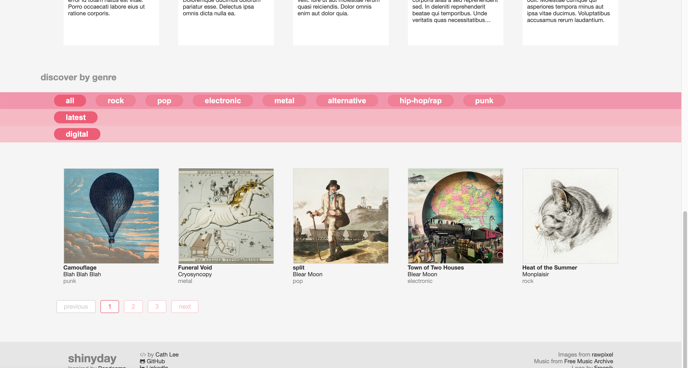
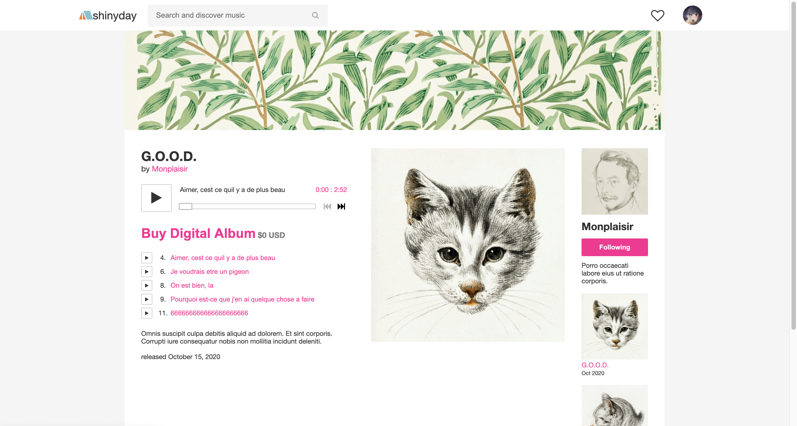
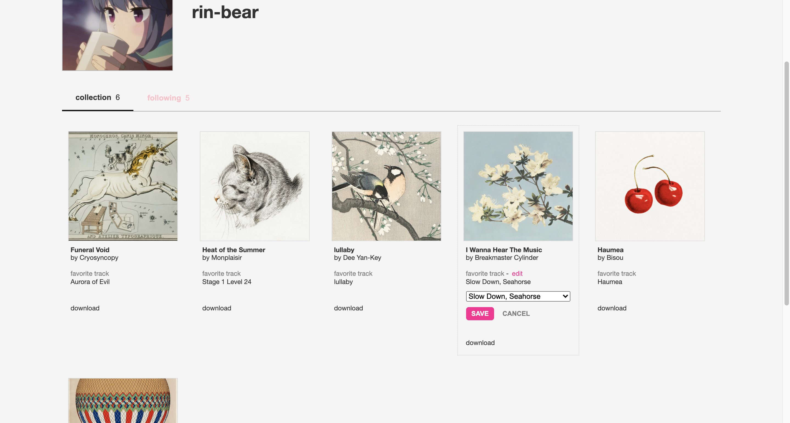
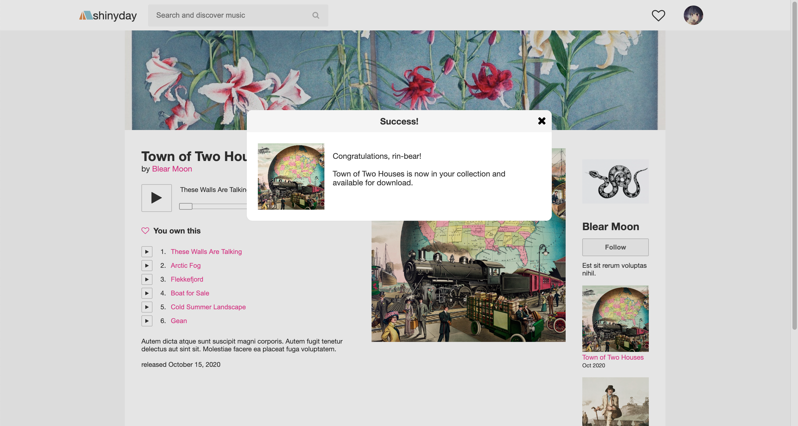

# shinyday

[Live Demo](https://shinyday.herokuapp.com)

Shinyday, a Bandcamp inspired website, was created using React, Express.js, and Sequelize with hosting provided by Heroku.

### Features

> React components made to match appearance of Bandcamp using customized CSS

> Muisc player made to match Bandcamp, file hosting through AWS S3 using the middleware Multer and Multer S3

> User authentication and authorization facilitated with bcrypt to hash passwords and JWTs with local storage for session management

> Users are able to download albums they have "supported" and select their favorite tracks to display on profiles
